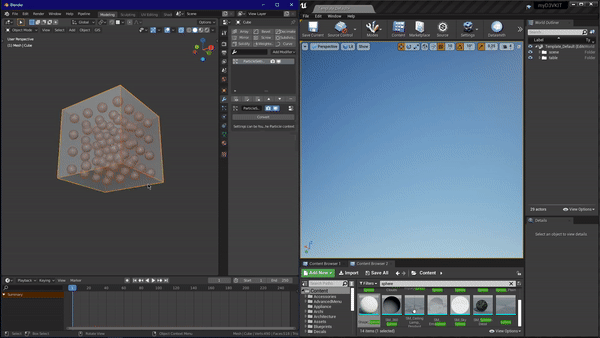

# CoordiKnight | Blender to Unreal Engine
## Copy location, rotation and scale of the selected objects from Blender to the clipboard and easily paste them into Unreal Engine.

This Blender addon allows you to copy the location/rotation/scale of all selected meshes in the scene to the clipboard and simply paste them into Unreal Engine has placeholder static meshes. Combined with Epic Games Send to Unreal addon, it's a fast and efficient way to position many instances of the same mesh or even position many objects of any kind all at once.

## A one-click solution for quickly placing a lot of instances in your levels!

## v1.1 IMPORTANT UPDATE
**The current updated version directly supports the Blender built-in clipboard functionality, so I removed the pyperclip module from the package and you don't need anymore to copy it into your system.
Just install the addon and you are good to go!**

---
☕🤎 If you find the content useful, you could get me a coffee at https://www.buymeacoffee.com/nazzareno

🙏 For more, you can follow me on <a href="https://twitter.com/nazzagnl">Twitter</a>, <a href="http://www.youtube.com/c/NazzarenoGiannelliCG">Youtube</a>, and <a href="https://www.instagram.com/nazzarenogiannelli">Instagram</a>

:globe_with_meridians: For more about what I do, you can visit my [personal website](https://www.nazzarenogiannelli.com/)
